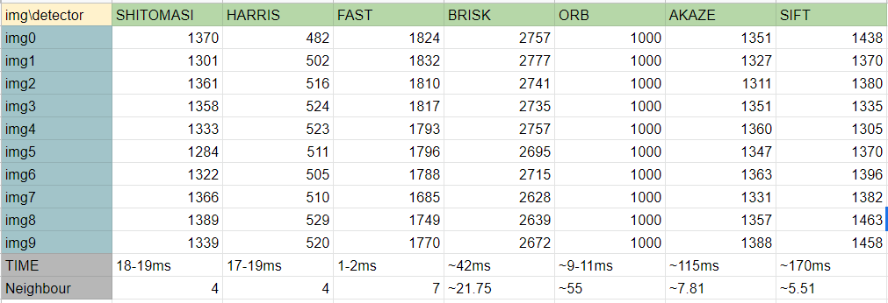
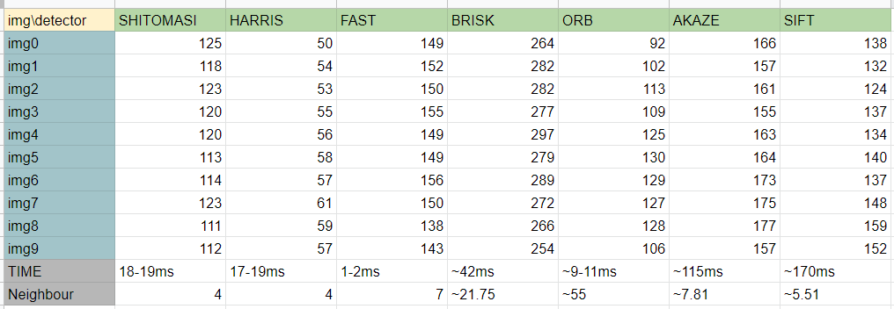
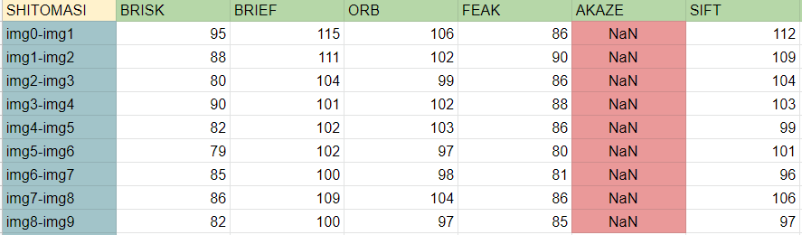
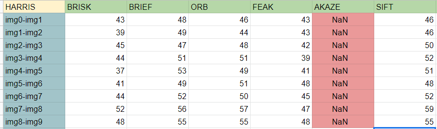
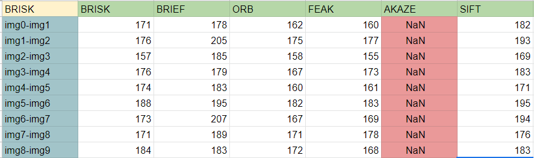
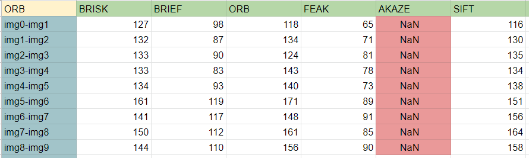
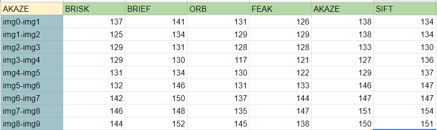
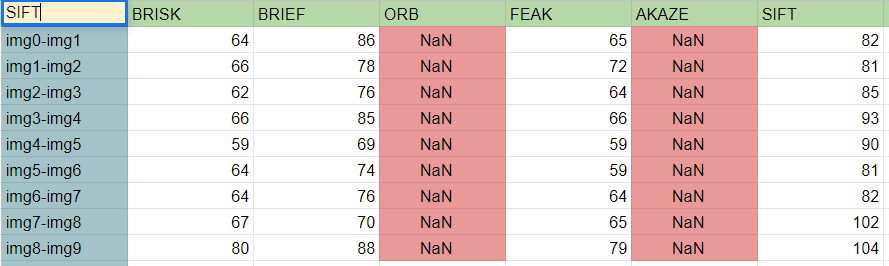
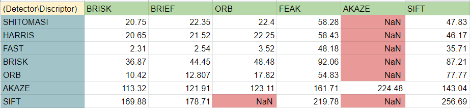

# SFND 2D Feature Tracking

The idea of the camera course is to build a collision detection system - that's the overall goal for the Final Project. As a preparation for this, you will now build the feature tracking part and test various detector / descriptor combinations to see which ones perform best. This mid-term project consists of four parts:

* First, you will focus on loading images, setting up data structures and putting everything into a ring buffer to optimize memory load. 
* Then, you will integrate several keypoint detectors such as HARRIS, FAST, BRISK and SIFT and compare them with regard to number of keypoints and speed. 
* In the next part, you will then focus on descriptor extraction and matching using brute force and also the FLANN approach we discussed in the previous lesson. 
* In the last part, once the code framework is complete, you will test the various algorithms in different combinations and compare them with regard to some performance measures. 

See the classroom instruction and code comments for more details on each of these parts. Once you are finished with this project, the keypoint matching part will be set up and you can proceed to the next lesson, where the focus is on integrating Lidar points and on object detection using deep-learning. 

## Dependencies for Running Locally
* cmake >= 2.8
  * All OSes: [click here for installation instructions](https://cmake.org/install/)
* make >= 4.1 (Linux, Mac), 3.81 (Windows)
  * Linux: make is installed by default on most Linux distros
  * Mac: [install Xcode command line tools to get make](https://developer.apple.com/xcode/features/)
  * Windows: [Click here for installation instructions](http://gnuwin32.sourceforge.net/packages/make.htm)
* OpenCV >= 4.1
  * This must be compiled from source using the `-D OPENCV_ENABLE_NONFREE=ON` cmake flag for testing the SIFT and SURF detectors.
  * The OpenCV 4.1.0 source code can be found [here](https://github.com/opencv/opencv/tree/4.1.0)
* gcc/g++ >= 5.4
  * Linux: gcc / g++ is installed by default on most Linux distros
  * Mac: same deal as make - [install Xcode command line tools](https://developer.apple.com/xcode/features/)
  * Windows: recommend using [MinGW](http://www.mingw.org/)

## Basic Build Instructions

1. Clone this repo.
2. Make a build directory in the top level directory: `mkdir build && cd build`
3. Compile: `cmake .. && make`
4. Run it: `./2D_feature_tracking`.

# Project Rubrics
 

### MP.1 Data Buffer

* To optimize the loading process for the images, a data buffer has been implemented.  
  * The new data arrives, it is added(.push_back()) at the end of a vector; named "dataBuffer".   
  * If the "dataBuffer" size increase more than 2, the oldest one is deleted (.erase()) and then the new one is added(.puch) at the end of the vector. 
  * The above cycle goes one until all the data has been processed. 

### MP.2 Keypoint Detection

* Following detector are used: SHITOMASI, HARRIS, FAST, BRISK, ORB, AKAZE, and SIFT. 
* To implement the above detectors, OpenCV libraries are used. 
 
Note: For SHITOMASI(detKeypointsShiTomasi()) and HARRIS(detKeypointsHarris()), spereate function is declared in matching2D_Student.cpp code, where as rest of the detector are declared under one function(detKeypointsModer())

#### "SHITOMASI": 
cv::goodFeaturesToTrack(img, corners, maxCorners, qualityLevel, minDistance, cv::Mat(), blockSize, false, k);
		
Attributes Passed:
* img: input image data 		
* vector<cv::Point2f> corners;
* qualityLevel - minimal accepted quality of image corners; double qualityLevel = 0.01; 
* int blockSize = 4;    //  size of an average block for computing a derivative covariation matrix over each pixel neighborhood
* double maxOverlap = 0.0; // max. permissible overlap between two features in %
* double minDistance = (1.0 - maxOverlap) * blockSize;
* int maxCorners = img.rows * img.cols / max(1.0, minDistance); // max. num. of keypoints
* false indicates that  cv::goodFeaturesToTrack() should work on SHITOMASI algorithm. 
* double k = 0.04;
 

#### "HARRIS": 
cv::goodFeaturesToTrack(img, corners, maxCorners, qualityLevel, minDistance, cv::Mat(), blockSize, true, k);

Attributes Passed:
* img: input image data 		
* vector<cv::Point2f> corners;
* qualityLevel - minimal accepted quality of image corners; double qualityLevel = 0.01; 
* int blockSize = 4;    //  size of an average block for computing a derivative covariation matrix over each pixel neighborhood
* double maxOverlap = 0.0; // max. permissible overlap between two features in %
* double minDistance = (1.0 - maxOverlap) * blockSize;
* int maxCorners = img.rows * img.cols / max(1.0, minDistance); // max. num. of keypoints
* true indicates that  cv::goodFeaturesToTrack() should work on HARRIS algorithm. 
* double k = 0.04;
 

#### "FAST": 
detector = cv::FastFeatureDetector::create(threshold, bNMS, type);
detector->detect(img, keypoints);

Attribute Passed: 
* int threshold = 30;
* bool bNMS = true; (NonMaxSuppression)
* type-> cv::FastFeatureDetector::TYPE_9_16;

#### "BRISK": 
detector = cv::BRISK::create();		
detector->detect(img, keypoints);

Default Attribute: 
* int thresh = 30;
* int octaves = 3;

#### "SIFT": 
detector = cv::xfeatures2d::SIFT::create();
detector->detect(img, keypoints);

Default Attribute:
* int nfeatures = 0; // The number of best features to retain.
* int nOctaveLayers = 3; // The number of layers in each octave. 3 is the value used in D. Lowe paper.
                                        // The contrast threshold used to filter out weak features in semi-uniform (low-contrast) regions.
* double contrastThreshold = 0.04;
* double edgeThreshold = 10; // The threshold used to filter out edge-like features.
* double sigma = 1.6; // The sigma of the Gaussian applied to the input image at the octave.

#### "ORB": 
detector = cv::ORB::create(nfeatures);
detector->detect(img, keypoints);

Attribute Passed: 
		* int nfeatures = "1000"  // The maximum number of features to retain.

Default Attribute: 
* float scaleFactor = 1.2f;  // Pyramid decimation ratio, greater than 1.
* int   nlevels = 8;         // The number of pyramid levels.
* int   edgeThreshold = 31;  // This is size of the border where the features are not detected.
* int   firstLevel = 0;      // The level of pyramid to put source image to.
* int   WTA_K = 2;           // The number of points that produce each element of the oriented BRIEF descriptor.
* auto  scoreType = cv::ORB::HARRIS_SCORE; // HARRIS_SCORE / FAST_SCORE algorithm is used to rank features.
* int   patchSize = 31;      // Size of the patch used by the oriented BRIEF descriptor.
* int   fastThreshold = 20;  // The FAST threshold.

#### "AKAZE": 
detector = cv::AKAZE::create();
detector->detect(img, keypoints);

Default Attribute: 
* auto  descriptor_type = cv::AKAZE::DESCRIPTOR_MLDB;
* int   descriptor_size = 0;        // Size of the descriptor in bits. 0 -> Full size
* int   descriptor_channels = 3;    // Number of channels in the descriptor (1, 2, 3).
* float threshold = 0.001f;         //   Detector response threshold to accept point.
* int   nOctaves = 4;               // Maximum octave evolution of the image.
* int   nOctaveLayers = 4;          // Default number of sublevels per scale level.
* auto  diffusivity = cv::KAZE::DIFF_PM_G2; // Diffusivity type. DIFF_PM_G1, DIFF_PM_G2,
    							  //DIFF_WEICKERT or DIFF_CHARBONNIER.
		

### MP.3 Keypoints Removal
* As we are only interested in the keypoint which are on the preceding vehicle, the rest of the keypoints are removed 
* Region of interest (ROI) is specified with cv::Rect function. (Cx = 535, Cy = 180, Width = 180, Height = 150)
* Loop through all the keypoints and all the keypoints which are inside the ROI are added to the new list. 

### MP.4 Keypoint Descriptor

* Following Keypoint Descriptor are used BRIEF, ORB, FREAK, AKAZE and SIFT
* To implement the above descriptor OpenCV libraries are used. 

Note: All the descriptor are declared inside "descKeypoints()" function. 

#### "BRISK": 
extractor = cv::BRISK::create(threshold, octaves, patternScale);
extractor->compute(img, keypoints, descriptors);

Attribute Passed:
* int threshold = 30;  // FAST/AGAST detection threshold score.
* int octaves = 3;   // detection octaves (use 0 to do single scale)
* float patternScale = 1.0f;  // apply this scale to the pattern used for sampling the neighbourhood of a keypoint.

#### "BRIEF": 
extractor = cv::xfeatures2d::BriefDescriptorExtractor::create();
extractor->compute(img, keypoints, descriptors);

Default Attribute: 
* int 	bytes = 32,
* bool 	use_orientation = false

#### "SIFT":
extractor = cv::xfeatures2d::SIFT::create();
extractor->compute(img, keypoints, descriptors);

Default Attribute: 
* int nfeatures = 0; // The number of best features to retain.
* int nOctaveLayers = 3; // The number of layers in each octave. 3 is the value used in D. Lowe paper.
* // The contrast threshold used to filter out weak features in semi-uniform (low-contrast) regions.
* double contrastThreshold = 0.04;
* double edgeThreshold = 10; // The threshold used to filter out edge-like features.
* double sigma = 1.6; // The sigma of the Gaussian applied to the input image at the octave #0.

#### "ORB":
extractor = cv::ORB::create(nfeatures);
extractor->compute(img, keypoints, descriptors);

Attribute Passed:
* int nfeatures = 1000;  // The maximum number of features to retain.
Default Attribute:
* float scaleFactor = 1.2f;  // Pyramid decimation ratio, greater than 1.
* int   nlevels = 8;         // The number of pyramid levels.
* int   edgeThreshold = 31;  // This is size of the border where the features are not detected.
* int   firstLevel = 0;      // The level of pyramid to put source image to.
* int   WTA_K = 2;           // The number of points that produce each element of the oriented BRIEF descriptor.
* auto  scoreType = cv::ORB::HARRIS_SCORE; // HARRIS_SCORE / FAST_SCORE -- to rank features.
* int   patchSize = 31;      // Size of the patch used by the oriented BRIEF descriptor.
* int   fastThreshold = 20;  // The FAST threshold.

#### "FREAK": 
extractor = cv::xfeatures2d::FREAK::create();
extractor->compute(img, keypoints, descriptors);

Default Attribute:
* bool	orientationNormalized = true;  // Enable orientation normalization.
* bool	scaleNormalized = true;        // Enable scale normalization.
* float patternScale = 22.0f;         // Scaling of the description pattern.
* int	nOctaves = 4;                     // Number of octaves covered by the detected keypoints.
* const std::vector< int > & 	selectedPairs = std::vector< int >(); // (Optional) user defined selected pairs indexes,

#### "AKAZE":
extractor = cv::AKAZE::create();
extractor->compute(img, keypoints, descriptors);

Default Attribute:
* auto  descriptor_type = cv::AKAZE::DESCRIPTOR_MLDB; // Type of the extracted descriptor: DESCRIPTOR_KAZE, DESCRIPTOR_KAZE_UPRIGHT, DESCRIPTOR_MLDB or DESCRIPTOR_MLDB_UPRIGHT.
* int   descriptor_size = 0;        // Size of the descriptor in bits. 0 -> Full size
* int   descriptor_channels = 3;    // Number of channels in the descriptor (1, 2, 3).
* float threshold = 0.001f;         //   Detector response threshold to accept point.
* int   nOctaves = 4;               // Maximum octave evolution of the image.
* int   nOctaveLayers = 4;          // Default number of sublevels per scale level.
* auto  diffusivity = cv::KAZE::DIFF_PM_G2; // Diffusivity type. DIFF_PM_G1, DIFF_PM_G2,
     							  //                   DIFF_WEICKERT or DIFF_CHARBONNIER.
### MP.5 Descriptor Matching. 

* FLANN: "fast library for approximate nearest neighbors". FLANN trains an indexing structure for walking through potential matching candidates that is created using concepts from machine learning. The library builds a very efficient data structure (a KD-tree) to search for matching pairs and avoids the exhaustive search of the brute force approach. It is therefore faster while the results are still very good, depending on the matching parameters.

* k-nearest neighbor selection: A very efficient way of lowering the number of false positives is to compute the nearest neighbor distance ratio. The main idea is to not apply the threshold on the SSD directly. Instead, for each keypoint in the source image, the two best matches are located in the reference image and the ratio between the descriptor distances is computed. Then, a threshold is applied to the ratio to sort out ambiguous matches. The figure below illustrates the principle.

* In this project, k is set to 2. 

### MP.6 Descriptor Distance Ratio

* In K-Nearest-Neighbor matching method, for each descriptor(keypoint) in the source image, K=2 best matches are found in the reference image. 
* The ratio between the two descriptor distances is computed. 
* The computed value is compared with some threshold. 
* If the computed value is less than the threshold, the best match in the reference image is accepted. But if the computed value is more than the threshold, the two descriptors from the reference image are considered ambiguous and the match is discarded 

### Total Number of Keypoints detected by each of the detectors(SHITOMASI, HARRIS, FAST, BRISK, ORB, AKAZE, and SIFT.) accross all the 10 images. Additionally average time required for the detector and avarage size of the neighbourhood is also included. 

### MP.7 Performance Evaluation 1: Number of Keypoints on the preceding vechicle. 

### Mp.8  Performance Evaluation 2

#### A. SHITOMASI detector. 

#### B. HARRIS detector. 

#### C. FAST detector.

#### D. BRISK detector. 

#### E. ORB detector. 

#### F. AKAZE detector. 

#### G. SIFT detector

### MP.9 Performance Evaluation 3. Time taken for keypoint detection and descriptor extraction.

Note: The performance is evaluated only in terms of speed, not accuracy. 
 

* FAST is the fasted detector for the list. 
* BRISK, BRIEF and ORB have better performance than rest of the descriptor. 

So according to me top 3 combinations are 
1. FAST detector and BRISK descriptor. 
2. FAST detector and BRIEF descriptor. 
3. FAST detector and ORB descriptor. 

